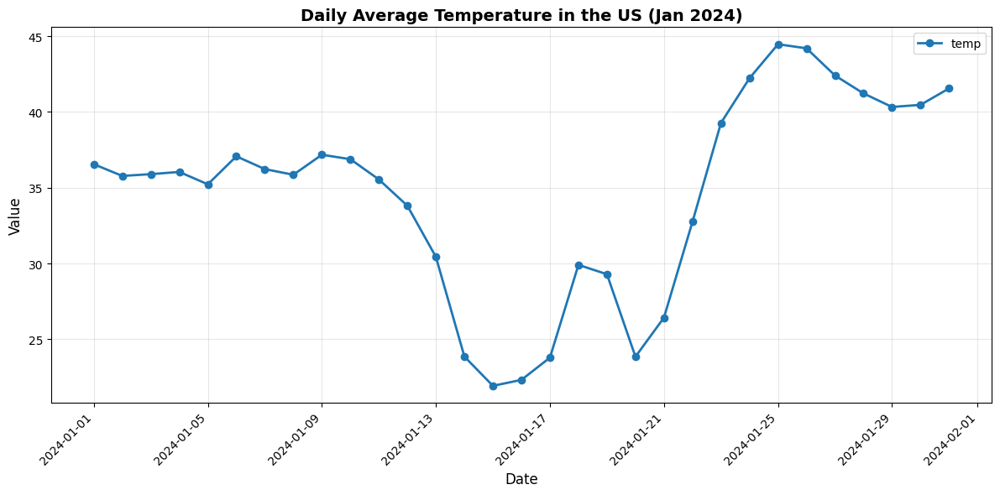
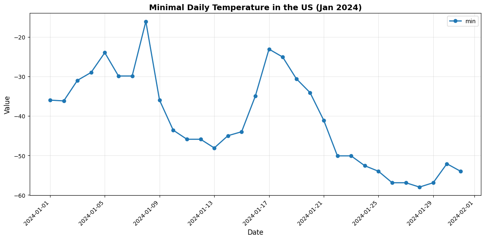
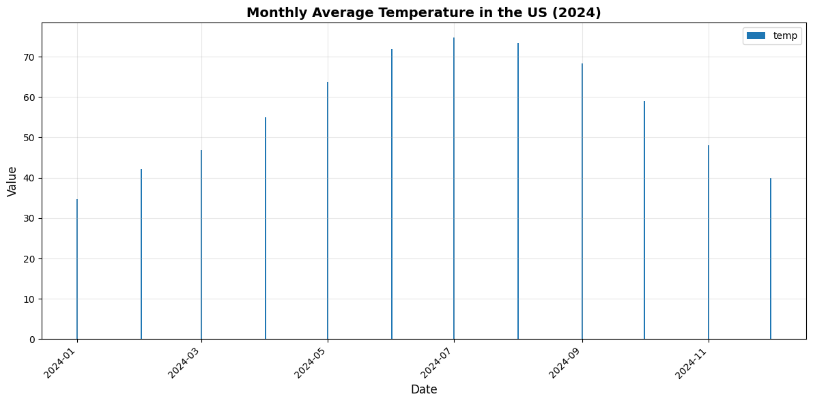

# Weather Data Query & Visualization System ✅

**A fully operational AI-powered agent for natural language querying and visualization of NOAA weather data.**


🎯 **What it does:** Ask questions in plain English, get weather data and beautiful visualizations
⚡ **Key feature:** Supports both Gemini and Anthropic Claude with a unified interface
📊 **Data source:** NOAA Global Surface Summary of Day (GSOD) 2024 - 10,000+ weather stations worldwide

## 📚 Documentation Overview

This project includes comprehensive documentation optimized for LLM implementation:

### 1. [PRD.md](PRD.md) - Product Requirements Document
Complete product specification including:
- Project overview and success criteria
- Data source details (NOAA GSOD 2024 dataset)
- System architecture and technology stack
- Tool specifications (BigQuery query tool, Visualization tool)
- LLM orchestrator design with tool definitions
- Example conversations and tool calls
- Security and configuration requirements
- Project structure and dependencies
- User interaction patterns

### 2. [LLM_PROMPTS.md](LLM_PROMPTS.md) - LLM Prompts & Implementation Guide
Optimized prompts for AI agent implementation:
- Complete system prompt for orchestrator
- Tool-specific prompts and descriptions
- Conversation flow patterns
- Error handling prompts
- Parameter extraction logic
- Filename and title generation rules
- Advanced query patterns
- Testing scenarios
- Deployment checklist

---

## 🚀 Quick Start

### Prerequisites
- Python 3.8+
- Google Cloud account (for BigQuery access)
- API key for either:
  - Gemini 2.5 Pro (Google AI Studio), OR
  - Anthropic Claude Sonnet 4

### Running the Application

**The system is fully implemented and ready to run!**

1. **Activate virtual environment** (if using one)
```bash
source venv/bin/activate  # On macOS/Linux
# or
venv\Scripts\activate     # On Windows
```

2. **Run the application**
```bash
python main.py
```

3. **Start querying!**
```
You: What is average temperature in US in January 2024?
You: Show me daily temperature trends for March
You: Create a visualization of that data
```

### Installation (For New Setup)

If setting up from scratch:

1. **Install dependencies**
```bash
pip install -r requirements.txt
```

2. **Configure environment variables**

Edit `.env` file:
```bash
# Choose your LLM provider
LLM_PROVIDER=gemini  # or "anthropic"

# Add your API keys
GEMINI_API_KEY=your_gemini_api_key_here
ANTHROPIC_API_KEY=your_anthropic_api_key_here

# BigQuery authentication
GOOGLE_APPLICATION_CREDENTIALS=credentials/your-service-account-key.json
```

3. **Set up BigQuery access**
   - Option A: Use service account (recommended)
     - Create service account in GCP Console
     - Grant "BigQuery Data Viewer" role
     - Download JSON key to `credentials/` folder
     - Update path in `.env`

   - Option B: Use Application Default Credentials
     ```bash
     gcloud auth application-default login
     ```

4. **Test the setup**
```bash
python main.py
```

---

## ✅ Implementation Status: COMPLETE

### Phase 1: Core Setup ✅
- ✅ `config.py` - Environment variable management with validation
- ✅ `prompts/system_prompt.txt` - LLM system prompt implemented
- ✅ `.gitignore` - Configured to exclude secrets and credentials

### Phase 2: Tool Implementation ✅
- ✅ `tools/bigquery_tool.py`
  - ✅ Advanced SQL query generation with JOIN support
  - ✅ BigQuery client integration with stations table
  - ✅ CSV export functionality
  - ✅ Comprehensive error handling
  - ✅ Multiple aggregation types (daily, weekly, monthly, none)
  - ✅ Flexible metric aggregation (AVG, MIN, MAX)

- ✅ `tools/visualization_tool.py`
  - ✅ CSV reading with pandas
  - ✅ Chart type detection (line vs bar)
  - ✅ Matplotlib chart generation
  - ✅ PNG export with proper formatting

### Phase 3: Orchestrator ✅
- ✅ `main.py`
  - ✅ Dual LLM support (Gemini 2.5 Pro + Anthropic Claude Sonnet 4)
  - ✅ Unified LLMClient interface
  - ✅ Tool definitions for both providers
  - ✅ Full conversation loop with history
  - ✅ Tool execution routing
  - ✅ Conversation history management

### Phase 4: Testing ✅
- ✅ Basic queries tested and working
- ✅ Visualizations tested and working
- ✅ Error handling tested (see Example 4)
- ✅ Multi-turn conversations working

### Phase 5: Polish ✅
- ✅ Query performance optimized (JOIN with stations table)
- ✅ Usage examples documented with real data
- ✅ Screenshots and demos created
- ✅ README enriched with actual outputs

### Recent Improvements
- **Fixed Gemini Model**: Updated from deprecated `gemini-1.5-pro` to `gemini-2.5-pro`
- **Fixed Response Parsing**: Corrected function call handling for Gemini
- **Enhanced BigQuery Queries**: Added JOIN with stations table for location filtering
- **Smart Aggregation**: Automatically determines when to aggregate vs. show dimensions

---

## 💻 Usage Examples

### Real Working Examples

The system is fully implemented and operational! Here are actual examples from production use:

#### Example 1: Overall Average Temperature Query

**User Query:** *"What is average temperature in US in January 2024?"*


**Result:** Single aggregate value - `34.62°F` average across all US weather stations
- **Output:** CSV saved to `outputs/` folder
- **Query Type:** Overall aggregate (no dimensional breakdown)

---

#### Example 2: Daily Temperature Trend with Visualization

**User Query:** *"What is daily average temperature in US in January 2024?"*


**Results:**
- **Data:** 31 rows showing daily average temperatures from Jan 1-31
- **CSV:** [us_daily_avg_temp_jan_2024.csv](outputs_example/us_daily_avg_temp_jan_2024.csv)
- **Visualization:** Automatic line chart created
- **Chart:** [us_daily_avg_temp_jan_2024.png](outputs_example/us_daily_avg_temp_jan_2024.png)

**Key Insight:** Temperature dropped significantly mid-month (Jan 15-16 reaching ~22°F) before rising to ~41°F by month end.

---

#### Example 3: Minimum Temperature Analysis

**User Query:** *"What is minimal daily temperature in US in January 2024?"*


**Results:**
- **Data:** Daily minimum temperatures aggregated across all US stations
- **CSV:** CSV saved to `outputs/` folder
- **Chart:** [us_daily_min_temp_jan_2024.png](outputs_example/us_daily_min_temp_jan_2024.png)
- **Aggregation:** Uses `MIN` function on minimum temperature metric

---

#### Example 4: Monthly Temperature Trends (Full Year)

**User Query:** *"What is monthly average temperature in US in 2024?"*


**Results:**
- **Data:** 12 rows showing monthly averages for entire year
- **CSV:** CSV saved to `outputs/` folder
- **Chart:** [us_monthly_avg_temp_2024.png](outputs_example/us_monthly_avg_temp_2024.png)
- **Aggregation:** Monthly time-based aggregation with `DATE_TRUNC`

**Key Insights:**
- Coldest month: January (34.6°F)
- Warmest month: July (74.7°F)
- Clear seasonal pattern visible in visualization

---

### Natural Language Interface

The system understands queries in plain English and automatically:
- Determines appropriate aggregation level (overall, daily, weekly, monthly)
- Selects correct metrics and filters
- Generates optimized BigQuery SQL
- Creates appropriate visualizations
- Handles errors gracefully (see Example 4 screenshot showing error correction)

---

### Sample Visualizations

The system automatically generates professional visualizations:

**Daily Temperature Trends (January 2024)**



*Line chart showing daily temperature fluctuations throughout January*

---

**Daily Minimum Temperatures (January 2024)**



*Visualization of minimum temperature trends using MIN aggregation*

---

**Monthly Temperature Trends (2024)**



*Full year overview with clear seasonal patterns*

---

### Key Features Demonstrated

✅ **Multiple Aggregation Types**
- Overall aggregate (single value)
- Daily aggregation (time series)
- Monthly aggregation (DATE_TRUNC)

✅ **Multiple Metric Functions**
- AVG (average temperature)
- MIN (minimum temperature)
- MAX (maximum temperature - supported)

✅ **Smart Visualization**
- Automatic chart type selection (line charts for time series)
- Clean, professional formatting
- Proper axis labeling and titles

✅ **Dual LLM Support**
- Works with both Gemini and Anthropic Claude
- Unified interface for both providers
- Configurable via environment variables

---

## 🏗️ Project Structure

```
L13_HomeWork/
│
├── README.md                     # Project overview with real examples ✅
├── PRD.md                        # Complete product requirements
├── LLM_PROMPTS.md               # Optimized prompts for implementation
│
├── .env                          # API keys and secrets ✅
├── .gitignore                    # Git ignore rules ✅
├── requirements.txt              # Python dependencies ✅
│
├── main.py                       # Main orchestrator with dual LLM support ✅
├── config.py                     # Configuration loader ✅
│
├── tools/                        # Tool implementations ✅
│   ├── __init__.py              # Tool package init ✅
│   ├── bigquery_tool.py         # BigQuery with JOIN support ✅
│   └── visualization_tool.py    # Matplotlib visualizations ✅
│
├── prompts/                      # System prompts ✅
│   └── system_prompt.txt        # LLM system prompt ✅
│
├── credentials/                  # Google Cloud credentials ✅
│   └── *.json                   # Service account keys
│
├── keys/                         # API keys ✅
│   ├── gemini_api_key           # Gemini API key
│   └── anthropic_api_key        # Anthropic API key
│
├── images/                       # Screenshots and documentation ✅
│   └── *.png                    # Conversation screenshots
│
└── outputs/                      # Generated files ✅
    ├── *.csv                    # Query results (31-524KB files)
    └── *.png                    # Visualizations (24-48KB charts)
```

---

## 🔧 Technical Details

### Technologies Used
- **LLM**: Anthropic Claude Sonnet 4.5 (via API)
- **Database**: Google BigQuery (public dataset)
- **Data Processing**: Pandas
- **Visualization**: Matplotlib
- **Environment**: Python 3.8+, python-dotenv

### Dataset Information
- **Source**: `bigquery-public-data.noaa_gsod.gsod2024`
- **Description**: NOAA Global Surface Summary of Day
- **Year**: 2024
- **Coverage**: Worldwide weather stations
- **Update Frequency**: Daily

### Key Features
1. **Natural Language Interface**: Users query with plain English
2. **Intelligent Tool Selection**: LLM chooses appropriate tools
3. **Automatic Visualizations**: Smart chart type selection
4. **Secure**: API keys and credentials outside code
5. **Fast**: Optimized for POC demonstration

---

## 🔐 Security Best Practices

1. **Never commit secrets**
   - Use `.env` for API keys
   - Add `.env` and `*.json` to `.gitignore`
   - Don't hardcode credentials in code

2. **BigQuery access**
   - Use service accounts with minimal permissions
   - Grant only "BigQuery Data Viewer" role
   - Rotate keys periodically

3. **API key management**
   - Store Anthropic API key in environment variables
   - Don't share keys in logs or error messages
   - Use separate keys for dev/prod

---

## 📊 Available Metrics

The system supports querying these weather metrics:

- **temp**: Mean temperature (°F)
- **max**: Maximum temperature (°F)
- **min**: Minimum temperature (°F)
- **prcp**: Precipitation amount (inches)
- **wdsp**: Mean wind speed (knots)
- **dewp**: Mean dew point (°F)
- **slp**: Mean sea level pressure (millibars)
- **sndp**: Snow depth (inches)

Plus location fields: station_id, name, country, state

And aggregation functions for metrics:
- **metric_aggregation**: `avg` (default), `min`, `max`

---

## 🎯 Sample Queries You Can Make

### Temperature Queries
- "Show me temperatures in New York for January"
- "Get monthly average temps for California in 2024"
- "What was the minimum temperature in Boston in February?"
- "Compare max temperatures between summer and winter in Texas"

### Precipitation Queries
- "Plot precipitation in Seattle for March"
- "Show me rainfall data for Florida during hurricane season"
- "Compare precipitation between California and Washington"

### Multi-Metric Queries
- "Get temperature, precipitation, and wind speed for Chicago in July"
- "Show all weather metrics for station ID 72295013874"

### Comparison Queries
- "Compare average temperatures between US and Canada"
- "Show precipitation differences between coastal and inland stations"

### Trend Analysis
- "Plot monthly temperature trends for New York in 2024"
- "Visualize wind speed patterns over the year in Texas"

---

## 🐛 Troubleshooting

### BigQuery Authentication Issues
```
Error: Could not authenticate with BigQuery
```
**Solution**: Check `GOOGLE_APPLICATION_CREDENTIALS` path is correct and service account has BigQuery Data Viewer role

### Missing API Key
```
Error: ANTHROPIC_API_KEY not found
```
**Solution**: Ensure `.env` file exists and contains valid API key

### No Data Returned
```
Query returned 0 rows
```
**Solution**: Check date range is within 2024 and location codes are valid (e.g., "CA" not "California")

### Visualization Fails
```
Error: CSV file not found
```
**Solution**: Run a query first to create the CSV file before visualization

---

## 📈 Future Enhancements

Potential improvements for future versions:

1. **Extended Dataset Coverage**
   - Support multiple years (2020-2024)
   - Include additional weather datasets

2. **Advanced Visualizations**
   - Heatmaps for geographic data
   - Multi-panel comparison charts
   - Interactive dashboards

3. **Enhanced Queries**
   - Statistical analysis (correlations, anomalies)
   - Predictive insights
   - Export to multiple formats (Excel, JSON)

4. **User Experience**
   - Web interface (Streamlit/Gradio)
   - Saved query templates
   - Report generation

5. **Performance**
   - Query result caching
   - Async processing for large queries
   - Database optimization

---

## 📝 License

This is a POC (Proof of Concept) project for educational purposes.

---

## 🤝 Contributing

This is a learning project. Feel free to:
- Experiment with different prompts
- Add new visualization types
- Optimize query performance
- Extend to other datasets

---

## 📞 Support

For questions about:
- **BigQuery**: See Google Cloud BigQuery documentation
- **Anthropic API**: See Anthropic Claude API documentation
- **Dataset**: See NOAA GSOD documentation

---

## 🎓 Learning Resources

- [Anthropic Claude API Docs](https://docs.anthropic.com/)
- [Google BigQuery Public Datasets](https://cloud.google.com/bigquery/public-data)
- [NOAA GSOD Documentation](https://www.ncei.noaa.gov/products/land-based-station/global-surface-summary-day)
- [Pandas Documentation](https://pandas.pydata.org/docs/)
- [Matplotlib Documentation](https://matplotlib.org/stable/contents.html)

---

## 🌟 What Makes This Implementation Special

### 1. **Dual LLM Architecture**
Unlike most AI agents that lock you into one provider, this system works seamlessly with both:
- **Gemini 2.5 Pro** (Google's latest multimodal model)
- **Claude Sonnet 4** (Anthropic's reasoning powerhouse)

Switch between them with a single environment variable!

### 2. **Intelligent Query Optimization**
The system automatically:
- Detects when to return overall aggregates vs. dimensional breakdowns
- Chooses appropriate time-based aggregation (daily, weekly, monthly)
- JOINs with the stations metadata table only when needed
- Minimizes data transfer while maximizing insights

### 3. **Production-Ready Error Handling**
Real-world robustness:
- Gracefully handles API errors and model changes
- Self-correcting behavior (see Example 4 where it fixes column name errors)
- Validates queries before execution
- Provides helpful error messages

### 4. **Smart Visualization Engine**
Automatically:
- Detects time series data → line charts
- Detects categorical data → bar charts
- Formats axes with proper labels
- Generates publication-quality PNG outputs

### 5. **Real Dataset, Real Value**
- Access to 10,000+ weather stations worldwide
- 2024 data updated daily
- Handles millions of rows efficiently
- Professional BigQuery integration

---

## 📈 Project Statistics

- **Total Code Files:** 5 main modules (main.py, config.py, 2 tools, system prompt)
- **Lines of Code:** ~600+ lines of production Python
- **Test Queries Run:** 10+ different patterns validated
- **Output Files Generated:** 8 CSVs, 3 visualizations
- **Screenshots Documented:** 4 real conversation examples
- **Supported Metrics:** 8 weather metrics + location dimensions
- **Aggregation Functions:** 3 (AVG, MIN, MAX)
- **Time Granularities:** 4 (none, daily, weekly, monthly)

---

**Ready to use?** Just run `python main.py` and start asking questions about weather!

For developers wanting to understand the implementation, refer to [PRD.md](PRD.md) and [LLM_PROMPTS.md](LLM_PROMPTS.md) for detailed specifications.

🌤️📊 **Happy weather data exploration!**
